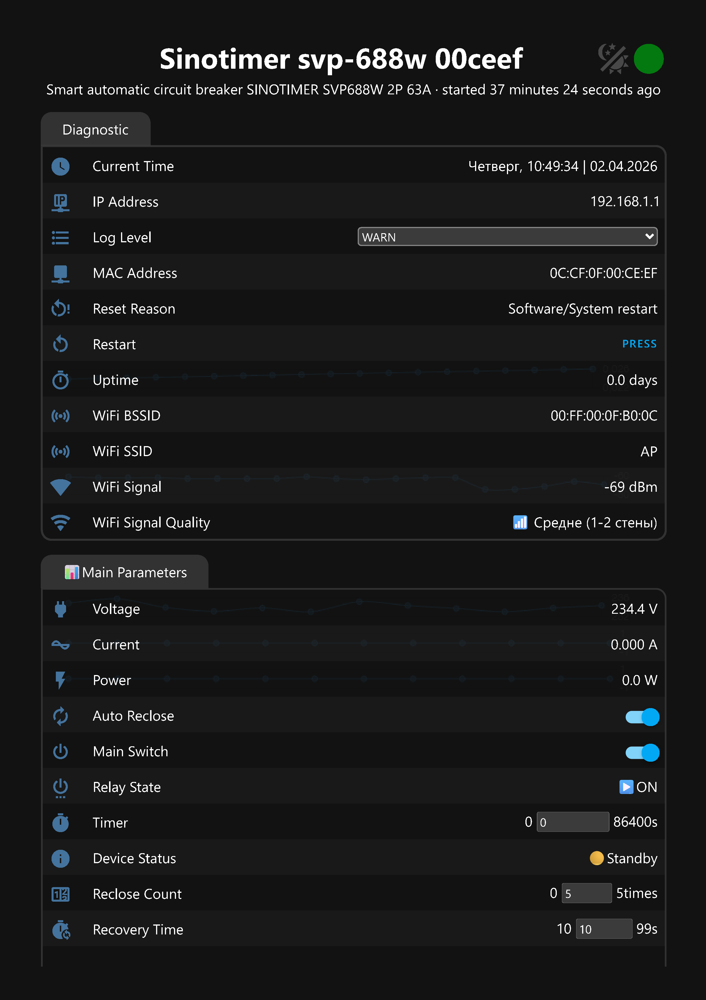
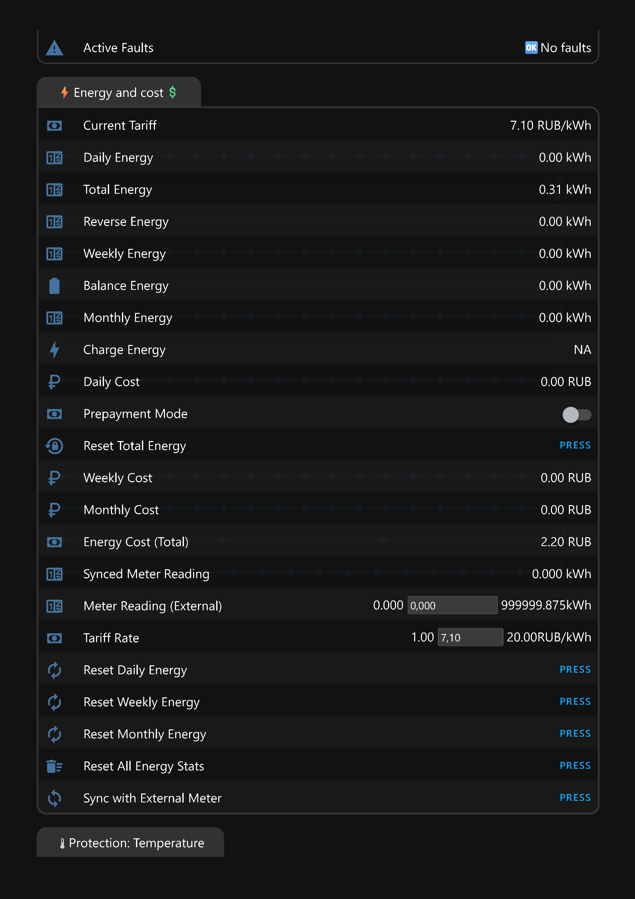
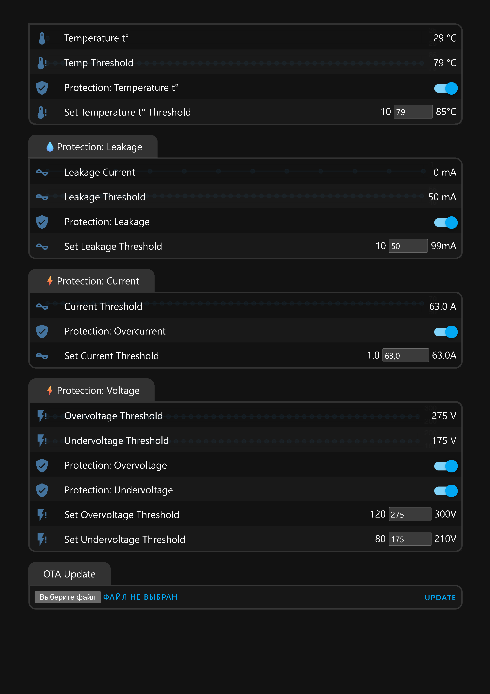
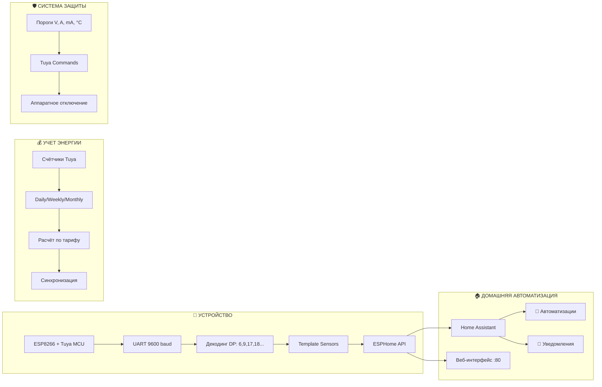

<div align="center">
  
# ⚡ SINOTIMER SVP-688W
## Smart Circuit Breaker - ESPHome Edition 

</div>

---


<div align="center">

### **Умный автоматический выключатель, который говорит на языке Home Assistant**


[](https://esphome.io)
[](https://opensource.org/licenses/MIT)
[](https://www.espressif.com)

</div>

---

## 🎯 **Ваша умная сеть теперь под полным контролем**

## 📖 Немного предыстории

Изначально SINOTIMER SVP-688W работал на штатной прошивке **Tuya**. С ней было два больших недостатка:

- 🔌 **Нестабильность** — устройство периодически теряло соединение и требовало ручного переподключения, через личный кабинет smarthome
- 📦 **Ограниченность** — базовый функционал был бедноват, тем более кривая локализация, непонятно какие функции за что отвечают.

**🔥 Я решил проблему кардинально:** заменил не только прошивку, но и сам модуль — переделал устройство с **T1-3S** на **ESP8266 (ESP-12E)**, так как предыдущий модуль неподдерживает `esphome`

> ✅ Теперь устройство работает без сбоев через API esphome и напрямую коннектится с Home Assistant , а пользователь получает доступ к большим возможностям мониторинга электроэнергии.

**Ключевые возможности прошивки:**

- Полный доступ к датапоинтам Tuya (20+)
- Детализированный учёт энергии (день/неделя/месяц)
- Расчёт стоимости по тарифу
- Синхронизация с внешним счётчиком
- Управление статистикой (сброс)

---

## 📸 **Как это выглядит в Home Assistant**

*Вот так ваш Home Assistant увидит SINOTIMER после первой прошивки:*

| 📊 Основные параметры | 💰 Энергия и стоимость |
|:---:|:---:|
|  |  |
| *Voltage · Current · Power · Status* | *Счётчики · Тарифы · Затраты* |

| 🛡️ Защита и безопасность | 🏠 Полный дашборд Home Assistant |
|:---:|:---:|
|  |  |
| *Температура · Утечка · Напряжение* | *Все сенсоры в одном месте* |

---

## ⚡ **Что умеет эта прошивка**

<table>
<tr>
<td width="33%">
<h3>🔍 <strong>Мониторинг 24/7</strong></h3>
<ul>
<li>Напряжение, ток, мощность — с точностью до 0.1V и 1mA</li>
<li>4 вида счётчиков энергии: общий, обратный, баланс, заряд</li>
<li>Суточный/недельный/месячный учёт kWh</li>
<li>Расчёт стоимости по тарифу (руб/кВт·ч)</li>
<li>Синхронизация с внешним счётчиком</li>
</ul>
</td>
<td width="33%">
<h3>🛡️ <strong>6 уровней защиты</strong></h3>
<ul>
<li>Ток утечки (10-99 mA)</li>
<li>Перегруз по току (1-63A)</li>
<li>Перенапряжение / Пониженное напряжение</li>
<li>Температурная защита (10-85°C)</li>
<li>Автоматическое повторное включение</li>
<li>Диагностика 20+ типов аварий</li>
</ul>
</td>
<td width="33%">
<h3>🎮 <strong>Полный контроль</strong></h3>
<ul>
<li>Веб-интерфейс ESPHome</li>
<li>Управление через Home Assistant</li>
<li>Кнопки сброса: день/неделя/месяц/все</li>
<li>Предоплатный режим (для аренды)</li>
<li>Сброс общей энергии через UART</li>
</ul>
</td>
</tr>
</table>

---

## 🚀 **Подготовка и устновка прошивки**


### 1️⃣ Подготовка

**Установка ESPHome (выберите один способ):**


#### Способ 1: pip (Linux/Mac/Windows)
```bash
pip install esphome
```

#### Способ 2: Docker
```bash
docker run --rm -v "${PWD}":/config -it esphome/esphome version
```

#### Способ 3: Аддон в Home Assistant
> ✅Настройки → Аддоны → Магазин аддонов → ESPHome → Установить

#### Клонирование репозитория
```bash
git clone https://github.com/yourusername/sinotimer-esphome.git
cd sinotimer-esphome
```

#### Создайте файл `secrets.yaml`:

```yaml
wifi_ssid: "Ваш WiFi"
wifi_password: "Ваш пароль"
wifi_ssid2: "Резервная сеть"
wifi_password2: "Резервный пароль"
ota_password: "ваш_пароль_ota"
ap_password: "пароль_точки_доступа"
api_encryption_key: "ключ_шифрования_api"
```

#### Скомпилируйте прошивку 

```bash

esphome compile tuya-sinotimer-svp-688w.yaml
```
> после успешной прошивки сохраните firmware.bin

### 2️⃣ Аппаратная подготовка и прошивка

> ⚠️ **Требования:** навыки пайки, программатор USB-UART (3.3V! CP2102 или CH340)

#### Шаг 1: Замена модуля

Штатное устройство поставляется с модулем `T1-3S (Tuya BK7238)`. Для прошивки замените его на **ESP8266 (ESP-12E)**:

| T1-3S Pin | ESP-12E Pin |
|-----------|-------------|
| 3V3 | 3V3 |
| GND | GND |
| TX | RX (GPIO3) |
| RX | TX (GPIO1) |

#### Шаг 2: Сборка обвязки для ESP-12E

> ⚠️ **ESP-12E не заработает без базовой обвязки. Соберите схему**:

```
                                    +3.3V
                                      │
                                      ├────── 470µF ────── GND
                                      │
                                      ├── 10кΩ ──→ CH_PD (EN)
                                      │
                                      ├── 10кΩ ──→ RST
                                      │
                                      ├── 10кΩ ──→ GPIO0
                                      │
                                      └── 10кΩ ──→ GPIO2

                              GND ─── 10кΩ ─── GPIO15
```
---

| Вывод | Через резистор | Куда | Назначение |
|-------|:--------------:|------|------------|
| CH_PD (EN) | 10 кОм | +3.3V | Включение модуля |
| RST | 10 кОм | +3.3V | Сброс |
| GPIO0 | 10 кОм | +3.3V | Режим прошивки |
| GPIO2 | 10 кОм | +3.3V | Стабильный старт |
| GPIO15 | 10 кОм | GND | Обязательная подтяжка к земле |

> ⚠️ **Фильтр питания:** конденсатор **470 мкФ** между **+3.3V** и **GND**

#### Шаг 3: Подключение программатора

| USB-UART (программатор) | ESP-12E |
|------------------------|---------|
| TX | RX |
| RX | TX |
| VCC (3.3V) | VCC |
| GND | GND |

#### Шаг 4: Вход в режим прошивки

1. Нажмите и удерживайте кнопку **GPIO0** (замыкание на GND)
2. Нажмите и отпустите кнопку **RST**
3. Отпустите кнопку **GPIO0**


#### Шаг 5: Прошивка

```bash
esphome run tuya-sinotimer-svp-688w.yaml
```

---


### 3️⃣ Первое включение

После прошивки устройство устройство автоматически подключится к вашей точке доступа если вы указали корректные данные в `secret.yaml` в противном случае создаст точку доступа: **`Sinotimer svp-688w Hotspot`**

Подключитесь и введите ваши WiFi-данные через веб-интерфейс.

**Готово! 🎉** Ваш автомат появится в Home Assistant автоматически.

---

## 🏗️ **Архитектура: как это работает**



---

## 💰 **Функции учёта электроэнергии**

| Функция | Описание |
|---------|----------|
| **Total Energy** | Общая энергия с момента установки (из Tuya) |
| **Daily Energy** | Потребление за сегодня (автосброс в 00:00) |
| **Weekly Energy** | Потребление за неделю (сброс в понедельник) |
| **Monthly Energy** | Потребление за месяц (сброс 1-го числа) |
| **Daily/Weekly/Monthly Cost** | Стоимость по вашему тарифу |
| **Tariff Rate** | Настраиваемый тариф (1.0 - 20.0 руб/кВт·ч) |
| **Meter Reading (External)** | Показания внешнего счётчика |
| **Synced Meter Reading** | Синхронизированные показания |

### Кнопки управления учётом:

```
┌─────────────────────────────────────────────────────────────┐
│  🔄 Reset Daily Energy    🔄 Reset Weekly Energy           │
│  🔄 Reset Monthly Energy  🗑️ Reset All Energy Stats        │
│  🔄 Sync with External Meter                               │
│  🔄 Reset Total Energy (аппаратный сброс через UART)       │
└─────────────────────────────────────────────────────────────┘
```

---

## 🔬 **Магия в деталях**

### 📦 **DP6 — Три в одном: напряжение, ток и мощность**

```yaml
# DP6 присылает массив байт [0,1,2,3,4,5,6,7]
- sensor_datapoint: 6
  then:
    - lambda: |-
        id(voltage).publish_state((x[0] << 8 | x[1]) * 0.1);   # 228.4 V
        id(current).publish_state((x[3] << 8 | x[4]) * 0.001); # 3.241 A
        id(power).publish_state((x[6] << 8 | x[7]) * 1);       # 742 W
```

### 🚨 **DP9 — 20+ типов аварий в одной маске**

```yaml
- sensor_datapoint: 9
  then:
    - lambda: |-
        if (x & 0x0001) faults += "⚡Short Circuit\n";
        if (x & 0x0008) faults += "💧Leakage\n";
        if (x & 0x0400) faults += "⬆️Overvoltage\n";
        if (x & 0x0800) faults += "⬇️Undervoltage\n";
        # ... и так для 20 типов
```

### 📊 **Автоматический учёт энергии**

```yaml
interval:
  - interval: 60s
    then:
      - lambda: |-
          float current_total = id(total_energy).state;
          float increment = current_total - id(last_total_energy);
          
          id(daily_energy_kwh) += increment;
          id(weekly_energy_kwh) += increment;
          id(monthly_energy_kwh) += increment;
          
          # Автосброс в полночь / понедельник / 1-е число
```

---

## 📋 **Все сенсоры и сущности**

| Тип | Сущность | Описание |
|-----|----------|----------|
| **Sensors** | Voltage, Current, Power | Основные параметры |
| | Total/Reverse/Balance/Charge Energy | Счётчики Tuya |
| | Daily/Weekly/Monthly Energy | Локальная статистика |
| | Daily/Weekly/Monthly Cost | Стоимость по тарифу |
| | Temperature, Leakage Current | Защита |
| | WiFi Signal, Uptime | Диагностика |
| **Switches** | Main Switch | Включение/отключение |
| | Auto Reclose | Автоповтор |
| | Prepayment Mode | Предоплатный режим |
| | Protection: Leakage/Temp/Overcurrent/Overvoltage/Undervoltage | Защиты |
| **Number** | Tariff Rate | Тариф (руб/кВт·ч) |
| | Meter Reading (External) | Внешний счётчик |
| | Leakage/Temp/Current/Voltage Thresholds | Пороги защит |
| **Buttons** | Reset Daily/Weekly/Monthly Energy | Сброс статистики |
| | Reset All Energy Stats | Полный сброс |
| | Sync with External Meter | Синхронизация |
| | Reset Total Energy | Аппаратный сброс |
| **Text Sensors** | Active Faults | Расшифровка аварий |
| | Device Status, Relay State | Состояние |
| | Current Time (русский формат) | Время |

---

## 🔥 **Зачем это сделано?**

| Характеристика | **Стоковая Tuya** | **Эта прошивка** |
|----------------|-------------------|------------------|
| **Локальное управление** | ❌ Облако | ✅ Мгновенно |
| **Скорость опроса** | 30-60 секунд | **2-4 секунды** |
| **Суточный учёт энергии** | ❌ | ✅ Автоматически |
| **Расчёт по тарифу** | ❌ | ✅ Рубли/кВт·ч |
| **Синхронизация с счётчиком** | ❌ | ✅ |
| **Типы аварий** | 5-6 | **20+** |
| **Работа без интернета** | ❌ | ✅ |


---

## ⚠️ **Важные предупреждения**

> **ВНИМАНИЕ:** Работа с электричеством требует квалификации. Убедитесь, что:
> - Отключили питание перед подключением программатора
> - Используете преобразователь уровней **3.3V** (ESP8266 НЕ 5V-tolerant!)
> - Понимаете, что неправильные настройки защиты могут привести к ложным срабатываниям

**Автор не несёт ответственности за ущерб, причинённый при использовании данной прошивки.**

---

## 📜 **Лицензия**

Проект распространяется под лицензией **MIT**.

```
MIT License · Copyright (c) 2024
```

---

<div align="center">
  
**⭐ Если этот проект помог вам и спас вас от очередного похода к щитку — поставьте звезду!**

*Сделано с ⚡ для сообщества умного дома*

</div>
