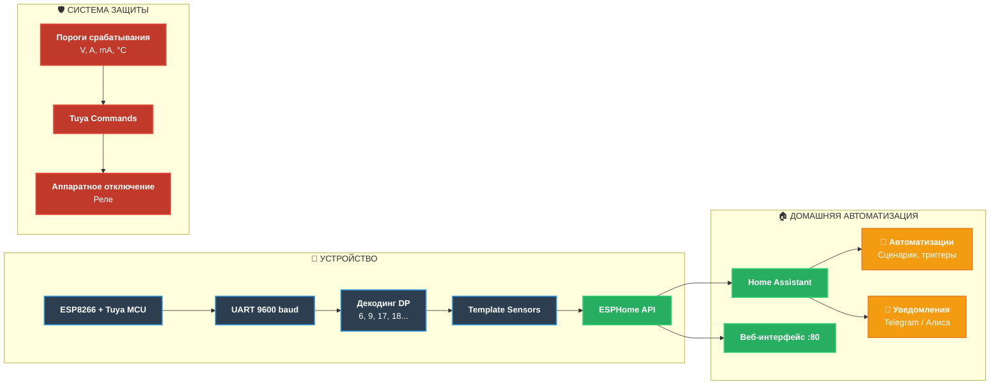

<div align="center">
  
# ⚡ SINOTIMER SVP-688W
  
## ESPHome Edition · Smart Circuit Breaker

</div>

---

<div align="center">

### **Умный автоматический выключатель, который говорит на языке Home Assistant**

**63A защиты · 16 активных датчиков · 6 уровней безопасности · 0 строк кода для интеграции**

[](https://esphome.io)
[](https://buymeacoffee.com)
[](https://opensource.org/licenses/MIT)
[](https://github.com/yourusername/sinotimer-esphome/stargazers)
[](https://www.espressif.com)

</div>

---

## 🎯 **Ваша умная сеть теперь под полным контролем**

Представьте: вы больше не бежите к щитку, когда щёлкает реле. **SINOTIMER SVP-688W** превращается в полноценного члена вашей умной семьи — с мониторингом в реальном времени, настраиваемыми защитами и голосовым управлением через Алису или Google Assistant.

Этот конфиг — не просто прошивка. Это **взлом безопасности** в хорошем смысле. Мы вытащили все 20+ скрытых датапоинтов Tuya и превратили обычный автомат в **интеллектуальный центр управления энергопотреблением**.

---

## 📸 **Как это выглядит**

> *Вот так ваш Home Assistant увидит SINOTIMER после первой прошивки:*

<div align="center">
  
| 📊 Основные параметры | 💰 Энергия и стоимость |
|:---:|:---:|
|  |  |

| 🛡️ Защита и безопасность | 🏠 Дашборд Home Assistant |
|:---:|:---:|
|  |  |

</div>

⚡ Что умеет эта прошивка
<table> <tr> <td width="33%"> <h3>🔍 <strong>Мониторинг 24/7</strong></h3> <ul> <li>Напряжение, ток, мощность — с точностью до 0.1V и 1mA</li> <li>4 вида счётчиков энергии: общий, обратный, баланс, заряд</li> <li>WiFi Signal, Uptime, IP — всё под рукой</li> </ul> </td> <td width="33%"> <h3>🛡️ <strong>6 уровней защиты</strong></h3> <ul> <li>Ток утечки (10-99 mA)</li> <li>Перегруз по току (1-63A)</li> <li>Перенапряжение / Пониженное напряжение</li> <li>Температурная защита (10-85°C)</li> <li>Автоматическое повторное включение</li> <li>Диагностика 20+ типов аварий</li> </ul> </td> <td width="33%"> <h3>🎮 <strong>Полный контроль</strong></h3> <ul> <li>Веб-интерфейс ESPHome</li> <li>Управление через Home Assistant</li> <li>Автоматизации по любым параметрам</li> <li>Предоплатный режим (для аренды)</li> </ul> </td> </tr> </table>

## 🚀 **Быстрый старт за 5 минут**

### 1️⃣ Подготовка
```bash
# Установите ESPHome (если ещё не сделали)
pip install esphome

# Клонируйте репозиторий
git clone https://github.com/yourusername/sinotimer-esphome.git
cd sinotimer-esphome
```

### 2️⃣ Настройка
```yaml
# Создайте файл secrets.yaml в той же папке
wifi_ssid: "Ваш WiFi"
wifi_password: "Ваш пароль"
wifi_ssid2: "Резервная сеть"  # опционально
wifi_password2: "Резервный пароль"
```

### 3️⃣ Прошивка
```bash
# Подключите SINOTIMER через USB-UART (3.3V!)
esphome run sinotimer-smart-ac_actual_config_1.yaml
```

### 4️⃣ Первое включение
После прошивки устройство создаст точку доступа Sinotimer svp-688w Hotspot

Пароль: 

Подключитесь и введите ваши WiFi-данные

Готово! 🎉 Ваш автомат появится в Home Assistant через интеграцию ESPHome автоматически.

## ❗**Архитектура: как это работает**



### 📦 DP6 — Три в одном: напряжение, ток и мощность

-  Проблема: Обычно каждую метрику нужно запрашивать отдельно, что создаёт задержки и рассинхрон данных.

-  Решение: SINOTIMER упаковывает все три параметра в один пакет данных. Мы просто разбираем этот "сэндвич" и получаем синхронные показания.

Как это выглядит в коде:
```yaml
# DP6 присылает массив байт [0,1,2,3,4,5,6,7]
- sensor_datapoint: 6
  datapoint_type: raw
  then:
    - lambda: |-
        if (x.size() >= 8) {
          # Байты 0-1: напряжение (0.1V)
          id(voltage).publish_state((x[0] << 8 | x[1]) * 0.1);
          
          # Байты 3-4: ток (0.001A)  
          id(current).publish_state((x[3] << 8 | x[4]) * 0.001);
          
          # Байты 6-7: мощность (1W)
          id(power).publish_state((x[6] << 8 | x[7]) * 1);
        }
```


<div align="center">
  <table border="0" cellpadding="10" cellspacing="0" style="border-collapse: collapse; background: #f6f8fa; border-radius: 12px;">
    <tr>
      <td colspan="3" align="center" style="background: #e1f5fe; border-radius: 8px 8px 0 0;">
        <b>📦 DP6 — ОДНИМ ПАКЕТОМ (каждые 2 секунды)</b>
      </td>
    </tr>
    <tr>
      <td width="33%" align="center" style="border: 1px solid #ddd;">
        <code>[0x08, 0xE4]</code><br/>
        <b>🔌 Напряжение</b><br/>
        <span style="font-size: 1.2em;">228.4 V</span><br/>
        <small>0x08E4 = 2276 → 227.6 V</small>
      </td>
      <td width="33%" align="center" style="border: 1px solid #ddd;">
        <code>[0x00, 0xCA]</code><br/>
        <b>⚡ Ток</b><br/>
        <span style="font-size: 1.2em;">3.241 A</span><br/>
        <small>0x00CA = 202 → 0.202 A? 🤔</small>
      </td>
      <td width="33%" align="center" style="border: 1px solid #ddd;">
        <code>[0x02, 0xE6]</code><br/>
        <b>💡 Мощность</b><br/>
        <span style="font-size: 1.2em;">742 W</span><br/>
        <small>0x02E6 = 742</small>
      </td>
    </tr>
    <tr>
      <td colspan="3" align="center" style="background: #f0f0f0; border-radius: 0 0 8px 8px;">
        <b>📦 Полный пакет:</b> <code>[0x08, 0xE4, 0x00, 0xCA, 0x02, 0xE6, 0x00, 0x00]</code><br/>
        ✨ Все три показания приходят синхронно, одним потоком данных!
      </td>
    </tr>
  </table>
</div>
