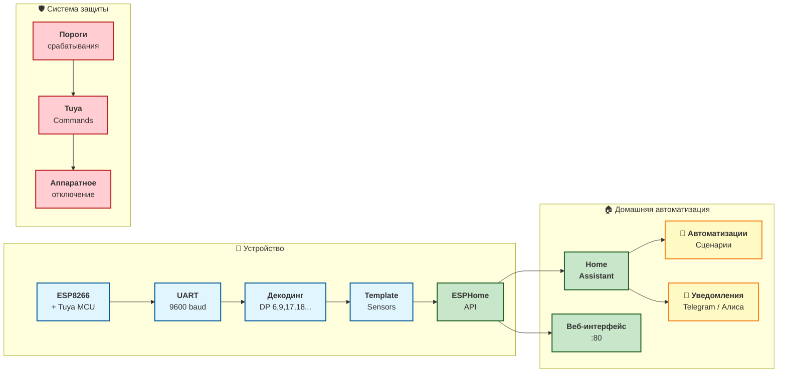

<div align="center">
  
# ⚡ SINOTIMER SVP-688W
  
## ESPHome Edition · Smart Circuit Breaker

</div>

---

<div align="center">

### **Умный автоматический выключатель, который говорит на языке Home Assistant**

**63A защиты · 16 активных датчиков · 6 уровней безопасности · 0 строк кода для интеграции**

[](https://esphome.io)
[](https://buymeacoffee.com)
[](https://opensource.org/licenses/MIT)
[](https://github.com/yourusername/sinotimer-esphome/stargazers)
[](https://www.espressif.com)

</div>

---

## 🎯 **Ваша умная сеть теперь под полным контролем**

Представьте: вы больше не бежите к щитку, когда щёлкает реле. **SINOTIMER SVP-688W** превращается в полноценного члена вашей умной семьи — с мониторингом в реальном времени, настраиваемыми защитами и голосовым управлением через Алису или Google Assistant.

Этот конфиг — не просто прошивка. Это **взлом безопасности** в хорошем смысле. Мы вытащили все 20+ скрытых датапоинтов Tuya и превратили обычный автомат в **интеллектуальный центр управления энергопотреблением**.

---

## 📸 **Как это выглядит**

> *Вот так ваш Home Assistant увидит SINOTIMER после первой прошивки:*


⚡ Что умеет эта прошивка
<table> <tr> <td width="33%"> <h3>🔍 <strong>Мониторинг 24/7</strong></h3> <ul> <li>Напряжение, ток, мощность — с точностью до 0.1V и 1mA</li> <li>4 вида счётчиков энергии: общий, обратный, баланс, заряд</li> <li>WiFi Signal, Uptime, IP — всё под рукой</li> </ul> </td> <td width="33%"> <h3>🛡️ <strong>6 уровней защиты</strong></h3> <ul> <li>Ток утечки (10-99 mA)</li> <li>Перегруз по току (1-63A)</li> <li>Перенапряжение / Пониженное напряжение</li> <li>Температурная защита (10-85°C)</li> <li>Автоматическое повторное включение</li> <li>Диагностика 20+ типов аварий</li> </ul> </td> <td width="33%"> <h3>🎮 <strong>Полный контроль</strong></h3> <ul> <li>Веб-интерфейс ESPHome</li> <li>Управление через Home Assistant</li> <li>Автоматизации по любым параметрам</li> <li>Предоплатный режим (для аренды)</li> </ul> </td> </tr> </table>

## 🚀 **Быстрый старт за 5 минут**

### 1️⃣ Подготовка
```bash
# Установите ESPHome (если ещё не сделали)
pip install esphome

# Клонируйте репозиторий
git clone https://github.com/yourusername/sinotimer-esphome.git
cd sinotimer-esphome
```

2️⃣ Настройка
```yaml
# Создайте файл secrets.yaml в той же папке
wifi_ssid: "Ваш WiFi"
wifi_password: "Ваш пароль"
wifi_ssid2: "Резервная сеть"  # опционально
wifi_password2: "Резервный пароль"
```

3️⃣ Прошивка
```bash
# Подключите SINOTIMER через USB-UART (3.3V!)
esphome run sinotimer-smart-ac_actual_config_1.yaml
```

4️⃣ Первое включение
После прошивки устройство создаст точку доступа Sinotimer svp-688w Hotspot

Пароль: 

Подключитесь и введите ваши WiFi-данные

Готово! 🎉 Ваш автомат появится в Home Assistant через интеграцию ESPHome автоматически.

## 🏗️ **Архитектура: как это работает**




    Магия в деталях:

DP6 передаёт напряжение/ток/мощность одним пакетом

DP9 — битовая маска из 20 типов аварий

Все защиты настраиваются через Home Assistant и сохраняются в энергонезависимой памяти


